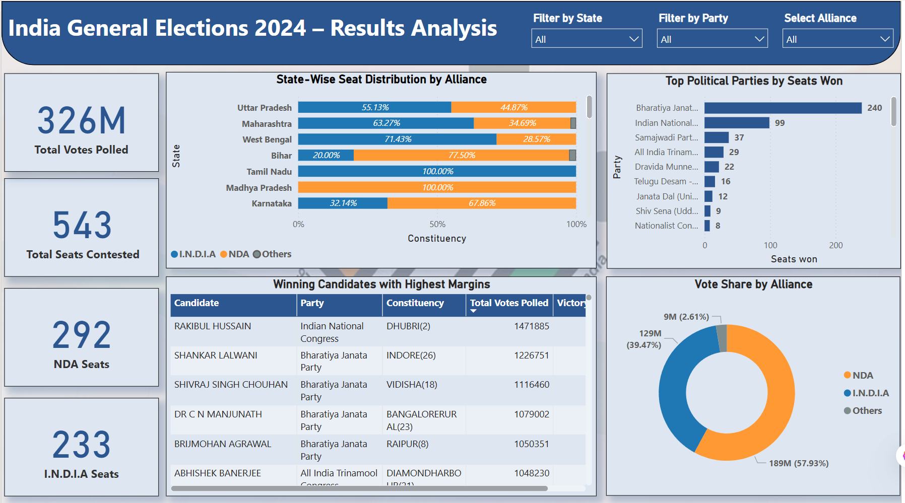

# India General Elections 2024 – Power BI Dashboard & SQL Analysis

This project presents an end-to-end data analysis and visualization of the **India General Elections 2024**, using raw CSV datasets and SQL logic to generate insights, and finally transforming the data into an interactive Power BI dashboard.

---

## 📊 Dashboard Highlights

The Power BI dashboard includes:

- ✅ **Vote Share by Alliance** (NDA, I.N.D.I.A, Others)
- ✅ **State-wise Seat Distribution by Alliance**
- ✅ **Top Political Parties by Seats Won**
- ✅ **Winning Candidates with Highest Margins**
- ✅ KPI cards showing Total Votes, Seats Contested, NDA Seats, and I.N.D.I.A Seats
- ✅ Dynamic slicers for filtering by **State**, **Party**, and **Alliance**

### 🔹 Power BI Dashboard Overview

---

## 📂 Datasets Used

| Dataset                     | Description                                      |
|-----------------------------|--------------------------------------------------|
| `constituencywise_results.csv` | Candidate-wise results, party IDs, votes, margins |
| `constituencywise_details.csv` | Candidate-level EVM vs Postal vote details       |
| `partywise_results.csv`        | Total seats won per party                        |
| `statewise_result.csv`         | State mapping with constituency & result status  |
| `states.csv`                   | Clean list of Indian states with IDs             |

---

## 🧠 Key Business Questions Answered

- Which party alliance won the most seats nationally and state-wise?
- What is the **vote share vs seat share** difference for alliances?
- Who were the **top candidates by victory margin**?
- How do vote patterns break down by **EVM vs Postal**?
- What are the top-performing parties nationally?

---

## 🛠 SQL Analysis Included

The SQL document (`India Elections Result Analysis.docx`) covers over 10 analytical queries:

- Total seats nationally and by state
- Seats won by **NDA** and **I.N.D.I.A** alliances
- Candidate-level margin, vote type, and EVM leaderboards
- Maharashtra-specific statistics (candidates, votes, parties)
- Alliance performance by state

Sample query:
sql
SELECT party_alliance, SUM(won) AS total_seats_won
FROM partywise_results
GROUP BY party_alliance
ORDER BY total_seats_won DESC;

📌 All SQL queries were written, tested, and cross-validated with the Power BI dashboard output.

---

## 🧩 Tools & Skills Used
Power BI (Data modeling, DAX, Power Query)

SQL (Joins, Aggregations, Conditional logic)

Data Cleaning & Transformation

Data Storytelling & Dashboard Design

---

## 📁 Folder Structure

📁 datasets/
    ├── constituencywise_results.csv
    ├── constituencywise_details.csv
    ├── partywise_results.csv
    ├── statewise_result.csv
    └── states.csv

📁 documentation/
    └── India Elections Result Analysis.docx

📊 dashboard/
    └── India_Election_2024_Dashboard.pbix

---

## 📌 Summary
This project demonstrates how raw electoral data can be transformed into actionable insights through SQL querying, data modeling, and Power BI storytelling. It's a strong example of how political data can be analyzed to uncover trends, alliances, and voter behavior across India.

---

## 🚀 How to Use This Project
Clone the repository

Open the .pbix file in Power BI Desktop

Explore the dashboard and slicers

Review SQL queries and try replicating them in your DB

---

## 📥 Download Power BI Dashboard

If GitHub doesn't support `.pbix` preview, you can [**download the dashboard here**](https://drive.google.com/file/d/1n4o7bvF5CI7euTdDhAae0b5SBCbyInCe/view?usp=sharing).

---

## ✍️ Author

**Shivam Kasaudhan**  
Aspiring Data Analyst 

[Connect with me on LinkedIn](https://www.linkedin.com/in/shivamkasaudhan1/)

---

